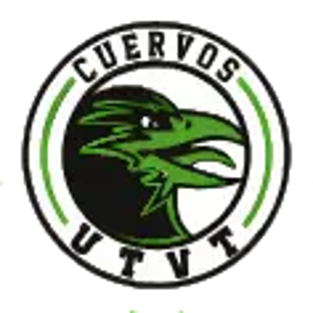

<h1 align="center">Sistema de Talleres Culturales y Deportivos UTVT</h1>

## 🚩Descripción

Este proyecto web tiene como objetivo gestionar los talleres de la universidad mediante un sistema que permite la inscripción de alumnos y la administración de asistencia por parte de los docentes. A través de esta plataforma, los estudiantes pueden inscribirse a los talleres de su interés, mientras que los profesores pueden visualizar la lista de inscritos y registrar su asistencia. Al final del cuatrimestre, si los alumnos cumplen con los requisitos de asistencia, podrán obtener su constancia de participación. Además, el sistema ofrece a los profesores la capacidad de publicar anuncios y eventos específicos para su taller, facilitando la comunicación con los estudiantes. De esta manera, la plataforma mejora la organización y accesibilidad de los talleres universitarios, proporcionando un entorno digital eficiente tanto para alumnos como para docentes.

## 🛠️ Herramientas utilizadas para el proyecto
<h3 align="center"><strong> Frontend: </strong></h3>

  <a href="https://developer.mozilla.org/en-US/docs/Web/JavaScript" target="_blank" rel="noreferrer"> 

<h3 align="center"><strong> Backend: </strong></h3>

</a>  

<h3 align="center"><strong> Database: </strong></h3>

## 💻 Principales Funcionalidades
- <strong>Gestión Integral</strong>: Administración de registros tanto de alumnos, docentes, talleres y anuncios. Subida y descarga de documentos y flayers para los anuncios. Estadisticas de los alumnos y talleres. Y generación de constancias.
- <strong>Acceso Seguro:</strong> Garantizamos que cada usuario vea solo la información relevante a su rol.

## 📄 Documentación
Para más información técnica revisa nuestra [documentación](https://github.com/DiazDeLosSantosJimena/Taller-UTVT/edit/main/documentation.md)...

## 🚥 Estado del proyecto:
<h3 align="center">En desarrollo...</h3>